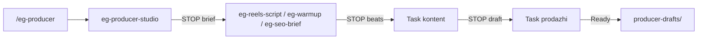

# t-800-factory-architect — Atmosfera 3D producer pack

**Date:** 2026-08-04  
**status:** ok  
**stage:** architect  
**mode:** CREATE + EXTEND (hybrid)  
**pack_name:** atmosfera-producer-mvp  
**agent:** t-800-factory-architect  
**memory_path:** `/Users/egoshev/Projects/atmosfera-3d/.cursor/t800-memory`  
**Handoff:** → `t-800-factory-builder` → `t-800-prompt-auditor` → auditor  
**NOT done:** production files (design/spec only)

---

## target_context

```yaml
target_context:
  workspace_root: "/Users/egoshev/Projects/atmosfera-3d"
  memory_path: "/Users/egoshev/Projects/atmosfera-3d/.cursor/t800-memory"
  artifact_surface: cursor-workspace
  profile: workspace-cursor
  knowledge_vault_path: null
  pack_name: atmosfera-producer-mvp
  brief: .cursor/t800-memory/factory-briefs/atmosfera-producer-mvp.yaml
  prompt_specs_source: fragments/t-800-prompt-craft.md  # AUTHORITATIVE bodies
  brain_ref: fragments/t-800-brain-lead.md
  research_ref: fragments/t-800-research-lead.md
```

---

## Decision matrix (type choice)

| Need | Type | Why |
|------|------|-----|
| voice/pillars/calendar/repurpose + route | **skill** `eg-producer-studio` | single-shot workflow; progressive L1–L3 |
| Reels hook→beats→script | **skill** `eg-reels-script` | craft pipeline; schema-first |
| Reels→Stories→Direct nurture | **skill** `eg-warmup` | sequence drafter |
| SEO brief / on-page copy draft | **skill** `eg-seo-brief` | Cursor-only; no site code |
| Orchestration + HITL STOP gates | **command** `/eg-producer` (+ alias) | slash router; mirrors eg-news-to-blog |
| Clean-context draft polish | **agent EXTEND** `kontent` | leaf drafter; skill-backed |
| Soft CTA / objections | **agent EXTEND** `prodazhi` | leaf; CTA pin anketa |
| Brand bans always-on | **REUSE rules** (no CREATE) | atmosfera-3d + eg-news-brand-safety |
| Critic / hooks / MCP / registry | **DO NOT** | brief + research reject |

**Verdict:** skill-first hybrid · EXTEND beats CREATE for agents · companions = none.

---

## File tree (CREATE / PATCH)

```text
CREATE:
  .cursor/skills/eg-producer-studio/
    SKILL.md
    references/
      voice-gate.md
      pillars.md
      calendar-schema.md
      repurpose-map.md
      cta-matrix.md
  .cursor/skills/eg-reels-script/
    SKILL.md
    references/
      beat-schema.yaml.md
      hook-patterns.md
      retention-spine.md
      anti-bait.md
      caption-cta.md
  .cursor/skills/eg-warmup/
    SKILL.md
    references/
      touch-map.md
      stories-beats.md
      direct-soft.md
      ladder-bridge.md
  .cursor/skills/eg-seo-brief/
    SKILL.md
    references/
      brief-schema.md
      cluster-cta.md
      meta-limits.md
      bans-seo.md
  .cursor/commands/eg-producer.md
  .cursor/commands/продюсер.md
  90_ВХОДЯЩИЕ/producer-drafts/.gitkeep

PATCH (EXTEND):
  .cursor/agents/kontent.md
  .cursor/agents/prodazhi.md

REUSE (read-only; do not recreate):
  .cursor/rules/atmosfera-3d.mdc
  .cursor/rules/eg-news-brand-safety.mdc
  .cursor/skills/eg-news-to-blog/          # HITL/command UX pattern + seo-clusters pointer
  .cursor/commands/eg-news-to-blog.md      # STOP/gate phrase style

OPTIONAL (integrator, non-blocking):
  AGENTS.md  # one-line mention of /eg-producer + producer-drafts/ if parent asks

DO_NOT create:
  new rules / hooks / mcp / critic agent / plugin registry / site / Remotion / TG-VK autopost
```

**Builder order (from brain):**
1. Scaffold 4 skills (SKILL.md + references/ stubs)
2. Scaffold `90_ВХОДЯЩИЕ/producer-drafts/.gitkeep`
3. PATCH EXTEND `kontent.md` + `prodazhi.md`
4. CREATE `eg-producer.md` + `продюсер.md`
5. NO new rules/hooks/MCP
6. → prompt-auditor

---

## Pack invariants (all artifacts)

```yaml
invariants:
  draft_path: 90_ВХОДЯЩИЕ/producer-drafts/
  published: false   # always explicit in drafts
  cta_default: https://eg.egoshev.ru/anketa
  cta_rule: one_cta_only
  youtube_ban: "never use eg.egoshev.ru as YouTube CTA domain"
  model: inherit     # agents: model: inherit; no pin
  zero_copy: "cite SoT paths; NEVER paste MASTER/ToV essays into SKILL/agent bodies"
  brand_bans:
    - medical_promises  # вылечим / исцеление / избавим навсегда / секретный|революционный метод
    - no_врач_claim
    - no_anti_gym
    - "без тренажёров ≠ без оборудования"
    - тело_мечты
    - FOMO_deficit_bait
    - multi_CTA / hashtag_spam / 👆
    - auto_tg / auto_vk / auto_blog_json / auto_meta
  hitl_gate_phrases_ru:
    - "Утверждаю brief"
    - "Утверждаю beats"
    - "Утверждаю черновик"
    - "Ready"
  companions:
    hooks: false
    scripts: false
    mcp: false
  registry_patch: null   # workspace-cursor — no plugin registry
```

### Zero-Copy SoT pointers (cite only)

| Cluster | Paths |
|---------|--------|
| brand_core | `.cursor/rules/atmosfera-3d.mdc` · `00_ПУЛЬТ_УПРАВЛЕНИЯ/ГЛАВНЫЙ_КОНТЕКСТ.md` · `03_РЕСУРСЫ/EG_ИМПЕРИЯ_ЗНАНИЙ/01_EG_OS_БРЕНД/TRAINING_SYSTEM_POSITIONING_MASTER.md` · `…/OWNERSHIP_MAP.md` |
| tone_safety | `.cursor/rules/eg-news-brand-safety.mdc` · optional `90_ВХОДЯЩИЕ/atmosfera-os-from-claude/.cursor/rules/10-voice-and-language.mdc` |
| products | `90_ВХОДЯЩИЕ/atmosfera-os-from-claude/.cursor/rules/20-products-prices.mdc` · ГЛАВНЫЙ_КОНТЕКСТ (ladder) — **not** invent `02_ЗОНЫ/продукты/` (absent) |
| seo | `01_ПРОЕКТЫ/P01_сайт_и_сервер/{SEO_KEYWORD_MAP,SEO_ФУНДАМЕНТ,СТИЛЬ_СТАТЕЙ_БЛОГА}.md` · `.cursor/skills/eg-news-to-blog/references/seo-clusters.md` |
| formulas_opt | `90_ВХОДЯЩИЕ/atmosfera-os-from-claude/.cursor/rules/30-content-formulas.mdc` |

---

## 1) CREATE skill: eg-producer-studio

```yaml
artifact: skill
action: CREATE
path: .cursor/skills/eg-producer-studio/SKILL.md
```

### Frontmatter (exact)

```yaml
---
name: eg-producer-studio
description: |
  Роутер продюсер-пака Атмосфера 3D: голос, столпы, календарь идей,
  репурпозинг brief → выбор craft-skill. HITL-черновики только.
  Use when: /eg-producer studio|calendar|repurpose; нужен voice gate,
  pillars, недельный план, маршрутизация в reels/warmup/seo.
  Do NOT use when: писать полный Reels-сценарий (→ eg-reels-script);
  прогрев Stories/Direct (→ eg-warmup); SEO money-page (→ eg-seo-brief);
  автопост TG/VK; правка сайта; Remotion; T-800 factory; медобещания.
disable-model-invocation: false
---
```

### Body structure (L2 — from prompt_spec; builder expands ≤~120 lines)

Mirror `eg-news-to-blog` section order:

1. **Title** `# eg-producer-studio`
2. **Роль** — voice/pillars/calendar/repurpose router EG; Zero-Copy SoT pointers
3. **Когда применять** — triggers + Do NOT (short; description already has routing)
4. **Что читать** — table of pointers only (rules + MASTER/OWNERSHIP/ГЛАВНЫЙ_КОНТЕКСТ + L3 refs) — **no essay paste**
5. **L3 refs** — list `references/*`
6. **Алгоритм**
   1. detect mode `studio|calendar|repurpose`
   2. voice gate vs bans
   3. emit structured brief YAML
   4. route → `eg-reels-script` | `eg-warmup` | `eg-seo-brief`
   5. STOP show brief + path — wait «Утверждаю brief»
   6. drafts → `90_ВХОДЯЩИЕ/producer-drafts/`
7. **Выход** — `brief_yaml` + `recommended_skill` + `draft_path` + `status: ok|needs_voice|blocked_ban`
8. **Связи** — invoked by `/eg-producer`; handoff craft skills; `Task(kontent)` after beats
9. **Запреты** — no autopost/site/medical; no YouTube CTA→eg.egoshev.ru; no monolith full scripts; Description Trap; Zero-Copy

### L3 references (stubs OK; titled + 1-line purpose)

| File | Purpose |
|------|---------|
| `references/voice-gate.md` | Checklist: tone EG vs bans before brief emit; pointers to brand rules (no essay dump) |
| `references/pillars.md` | Content pillars map (движение · дыхание · дисциплина + utility angles) — cite SoT |
| `references/calendar-schema.md` | YAML schema for weekly idea calendar (day, pillar, format, CTA_level) |
| `references/repurpose-map.md` | Source→formats matrix (Reels↔Stories↔SEO↔warmup) without auto-publish |
| `references/cta-matrix.md` | One-ask CTA rail → `https://eg.egoshev.ru/anketa`; stages curiosity→soft_ask |

---

## 2) CREATE skill: eg-reels-script

```yaml
artifact: skill
action: CREATE
path: .cursor/skills/eg-reels-script/SKILL.md
```

### Frontmatter (exact)

```yaml
---
name: eg-reels-script
description: |
  Сценарии Reels Атмосфера 3D: хуки (batch), timed grid, retention spine,
  caption с одним CTA→анкета. Только HITL-черновики.
  Use when: /eg-producer reels; нужен сценарий/озвучка/caption Instagram Reels
  в тоне EG; beats→draft после eg-producer-studio brief.
  Do NOT use when: прогрев Stories/Direct (→ eg-warmup); SEO/blog brief
  (→ eg-seo-brief); Remotion/рендер; автопост; viral bait/FOMO; медобещания;
  YouTube CTA на eg.egoshev.ru.
---
```

*(No `disable-model-invocation` required; omit or `false`. Prefer omit if unused — builder: match eg-producer-studio pattern with `false` OR omit; **do not** invent agent fields.)*

**Builder note:** skill FM = `name` + `description` (+ optional `disable-model-invocation`). Prefer:

```yaml
disable-model-invocation: false
```

for consistency with studio skill.

### Body structure (L2)

1. **Роль** — Reels craft: hook×3 → spine → timed grid → caption one-ask CTA
2. **Что читать** — studio brief; atmosfera-3d; eg-news-brand-safety; L3
3. **Алгоритм**
   1. load brief
   2. emit beat YAML schema **FIRST** (hook / tension / mechanism / what_to_do / result_feel / cta / duration_sec[] / channel:reels)
   3. STOP beats — «Утверждаю beats»
   4. after OK → prose script RU speakable
   5. caption + ONE CTA `https://eg.egoshev.ru/anketa`
   6. ban scan
   7. save draft `published: false` → producer-drafts/
   8. STOP ready-for-kontent — «Утверждаю черновик» / handoff
4. **Выход** — `beats_yaml` + `script_md_path` + `caption` + `cta` + `ban_scan_ok`
5. **Связи** — from studio|/eg-producer; next `Task(kontent)`; soft CTA via `Task(prodazhi)`
6. **Запреты** — no FOMO/deficit; no medical; no multi-CTA; no hashtag spam; no auto TG/VK; no Remotion

### L3 references

| File | Purpose |
|------|---------|
| `references/beat-schema.yaml.md` | Canonical beat YAML fields + example skeleton (schema-first) |
| `references/hook-patterns.md` | EG-safe hook batch patterns (3 options); strip viral bait |
| `references/retention-spine.md` | Mid-roll retention beats / timed grid guidance |
| `references/anti-bait.md` | FOMO/deficit/hashtag/👆 bans checklist for Reels |
| `references/caption-cta.md` | Caption template + single CTA anketa + soft ask variants |

---

## 3) CREATE skill: eg-warmup

```yaml
artifact: skill
action: CREATE
path: .cursor/skills/eg-warmup/SKILL.md
```

### Frontmatter (exact)

```yaml
---
name: eg-warmup
description: |
  Прогрев HITL: последовательность Reels→Stories→Direct (nurture) для
  Атмосфера 3D. Черновики касаний + soft bridge к анкете.
  Use when: /eg-producer warmup; серия Stories после Reels; директ-прогрев
  до заявки; nurture 3–7 касаний без автопоста.
  Do NOT use when: полный Reels-сценарий с нуля (→ eg-reels-script);
  SEO (→ eg-seo-brief); авторассылка TG/VK; давление/дефицит; медобещания;
  правки бота (→ eg-bot-*).
disable-model-invocation: false
---
```

### Body structure (L2)

1. **Роль** — nurture sequence drafter — touch map Reels→Stories→Direct→anketa
2. **Что читать** — studio brief + reels draft if any; brand rules; L3
3. **Алгоритм**
   1. goal + audience stage
   2. emit touch YAML (`day`, `channel`, `beat`, `CTA_level`)
   3. STOP map — «Утверждаю brief» (or beats-equivalent for map)
   4. draft each touch RU
   5. one soft CTA rail→anketa at **end** only
   6. ban scan
   7. save → producer-drafts/
   8. STOP
4. **CTA levels** — `none` | `curiosity` | `soft_ask` — never hard close every touch
5. **Выход** — `touch_map_yaml` + `drafts_dir` + `final_cta` + `status`
6. **Связи** — `/eg-producer`; kontent polish; prodazhi for objection-ready Direct
7. **Запреты** — no auto-send; no spam cadence; no medical; no multi-product dump; no FOMO timers

### L3 references

| File | Purpose |
|------|---------|
| `references/touch-map.md` | YAML schema for nurture sequence (day/channel/beat/CTA_level) |
| `references/stories-beats.md` | Stories beat templates (observation→mechanism→soft next) |
| `references/direct-soft.md` | Soft Direct reply frames; no pressure; bridge to anketa |
| `references/ladder-bridge.md` | Product ladder soft bridge pointers (20-products-prices + context) |

---

## 4) CREATE skill: eg-seo-brief

```yaml
artifact: skill
action: CREATE
path: .cursor/skills/eg-seo-brief/SKILL.md
```

### Frontmatter (exact)

```yaml
---
name: eg-seo-brief
description: |
  SEO-brief и money/blog copy-черновики EG в Cursor (HITL). Без правок
  кода сайта Wave2. CTA→анкета / продуктовая лестница.
  Use when: /eg-producer seo; бриф страницы/статьи; H1–H2 outline;
  meta title/description draft; cluster→CTA map.
  Do NOT use when: правка Next/site кода; publish blog.json; RSS news
  pipeline (→ eg-news-to-blog); Remotion; автопост; медобещания;
  verbatim full-text rewrite чужих статей без cite.
disable-model-invocation: false
---
```

### Body structure (L2)

1. **Роль** — SEO brief + on-page copy draft operator (Cursor-only)
2. **Что читать** — `СТИЛЬ_СТАТЕЙ_БЛОГА.md`; eg-news `seo-clusters.md` (pointer); brand rules; L3
3. **Алгоритм**
   1. intent + cluster
   2. brief YAML (`slug`, `H1`, `H2[]`, `intent`, `proof`, `CTA`)
   3. STOP brief — «Утверждаю brief»
   4. optional copy draft sections RU
   5. `published: false`
   6. save → producer-drafts/
   7. STOP — **no site write**
4. **Overlap** — if social/blog news path → point to `eg-news-to-blog` dual HITL; do not duplicate
5. **Выход** — `seo_brief_yaml` + `optional_draft_md` + `cta` + `status`
6. **Связи** — `/eg-producer`; Wave2 Dev outside pack; eg-news-to-blog for editorial news
7. **Запреты** — no site edits; no blog.json; no TG/VK; no medical SEO bait; no keyword stuffing

### L3 references

| File | Purpose |
|------|---------|
| `references/brief-schema.md` | SEO brief YAML fields (slug/H1/H2/intent/proof/CTA) |
| `references/cluster-cta.md` | Cluster→single CTA anketa map; pointer to eg-news seo-clusters |
| `references/meta-limits.md` | Meta title/description length + tone limits |
| `references/bans-seo.md` | Medical bait / stuffing / multi-CTA / site-edit bans |

---

## 5) EXTEND agent: kontent

```yaml
artifact: agent
action: EXTEND
path: .cursor/agents/kontent.md
```

### Current state (thin)

- FM: only `name` + `description` (incomplete)
- Body: generic content-director; drafts → `02_ЗОНЫ/контент/`; multi-CTA rotate

### Target frontmatter (EXACTLY 5 fields — no `tools:`)

```yaml
---
name: kontent
description: |
  Драфтер контента Атмосфера 3D: beats→черновик Reels/Stories/пост
  через producer skills. HITL only.
  Use when: Task(kontent) после /eg-producer или craft-skill beats;
  нужна полировка сценария/поста в тоне EG; Instagram/TG тексты.
  Do NOT use when: CTA/возражения/анкета (→ prodazhi); SEO site code;
  автопост TG/VK; Remotion; news→blog (→ eg-news-to-blog);
  создание новых Cursor-артефактов (→ T-800 factory).
model: inherit
readonly: false
is_background: false
---
```

### Body structure (REPLACE thin body; keep identity; <150 lines)

1. **Роль** — content drafter, skill-backed; clean context; parent passes beats+constraints
2. **Что читать** — parent `beats_yaml`; Read matching skill L2/L3 (`eg-reels-script` | `eg-warmup` | `eg-producer-studio`); `.cursor/rules/atmosfera-3d.mdc`; `eg-news-brand-safety`
3. **Алгоритм**
   1. validate beats schema present
   2. Read matching skill (do **not** re-encode full craft)
   3. draft RU speakable
   4. ban scan
   5. write **ONLY** to `90_ВХОДЯЩИЕ/producer-drafts/` unless parent path
   6. return `draft_path` + checklist
   7. STOP — no publish
4. **Выход** — `draft_md_path` + `channel` + `ban_scan` + `next: Task(prodazhi)|ready`
5. **Связи** — calledBy `/eg-producer`|main; calls skills via **Read** not Task; handoff prodazhi for CTA
6. **Запреты** — no `tools:` FM; no autopost; no medical; no invent beats without schema; no overwrite live `02_ЗОНЫ` without HITL note; leaf — no nested Task

### Patch plan

| Change | Detail |
|--------|--------|
| FM upgrade | Add `model`/`readonly`/`is_background`; expand description Use when / Do NOT |
| Draft path | Default → `90_ВХОДЯЩИЕ/producer-drafts/` (was `02_ЗОНЫ/контент/`) |
| Skill-backed | Invoke producer skills by Read; do not duplicate craft essays |
| CTA | Do **not** own CTA — defer to prodazhi / single anketa |
| Identity | Keep name `kontent`; still «контент-драфтер Атмосфера 3D» |

### Graph

```yaml
calls: []          # leaf — Read skills, no nested Task
calledBy: ["eg-producer", "main"]
```

---

## 6) EXTEND agent: prodazhi

```yaml
artifact: agent
action: EXTEND
path: .cursor/agents/prodazhi.md
```

### Current state (thin)

- FM: only `name` + `description`
- Body: sales manager; drafts → `02_ЗОНЫ/продажи/`; reads missing `02_ЗОНЫ/продукты/`

### Target frontmatter (EXACTLY 5 fields)

```yaml
---
name: prodazhi
description: |
  Soft offer-bridge Атмосфера 3D: CTA→анкета, директ, возражения,
  follow-up. Ban-scan коммерческих формулировок. HITL only.
  Use when: Task(prodazhi) после kontent/draft; нужен один CTA
  https://eg.egoshev.ru/anketa; ответ в директ; разбор возражений;
  мягкий bridge к лестнице продуктов.
  Do NOT use when: писать Reels/сценарии с нуля (→ kontent / eg-reels-script);
  автопост/рассылка; правка бота кода (→ eg-bot-engineer); медобещания;
  жёсткий дефицит/FOMO; T-800 factory.
model: inherit
readonly: false
is_background: false
---
```

### Body structure (REPLACE; <150 lines)

1. **Роль** — CTA/anketa/objections specialist — soft bridge, not closer
2. **Что читать** — parent draft; `20-products-prices.mdc` + ГЛАВНЫЙ_КОНТЕКСТ (ladder); brand bans; `eg-producer-studio/references/cta-matrix.md`
3. **Алгоритм**
   1. read draft + intent
   2. **one CTA only** → `https://eg.egoshev.ru/anketa`
   3. soft Direct/Stories CTA variants (short / premium)
   4. objections map without pressure
   5. ban scan medical + infobiz
   6. save offer snippets → producer-drafts/
   7. STOP
4. **Выход** — `cta_block` + `direct_replies[]` + `objections[]` + `ban_scan_ok` + `draft_path`
5. **Связи** — calledBy `/eg-producer` after kontent; may **cite** `eg-bot-manager-flow` for FAQ tone — **no bot code**
6. **Запреты** — no multi-CTA; no auto TG/VK; no medical guarantees; no «тело мечты»; no YouTube→eg domain as CTA; no `tools:` field; leaf — no nested Task

### Patch plan

| Change | Detail |
|--------|--------|
| FM upgrade | 5-field + Use when / Do NOT |
| CTA pin | Hard-pin anketa URL; one_cta_only |
| Draft path | → `90_ВХОДЯЩИЕ/producer-drafts/` (was `02_ЗОНЫ/продажи/`) |
| Products pointer | Replace absent `02_ЗОНЫ/продукты/` with `20-products-prices.mdc` + ГЛАВНЫЙ_КОНТЕКСТ |
| Soft bridge | Ban FOMO / hard-close |

### Graph

```yaml
calls: []
calledBy: ["eg-producer", "kontent", "main"]
```

---

## 7) CREATE command: /eg-producer

```yaml
artifact: command
action: CREATE
path: .cursor/commands/eg-producer.md
```

### Frontmatter (command = name + description only)

```yaml
---
name: eg-producer
description: |
  Продюсер-пак Атмосфера 3D: studio→craft→kontent→prodazhi CTA.
  HITL STOP на brief, beats, draft, ready. Без автопоста.
  Use when: /eg-producer или /продюсер; нужен контент-пайплайн
  (reels|warmup|seo|calendar) с черновиками в producer-drafts.
  Do NOT use when: eg-news-to-blog; Remotion; автопост TG/VK;
  правка сайта; деплой бота; T-800 factory.
---
```

### Body structure (thin router — mirror eg-news-to-blog.md)

1. **Заголовок** `# /eg-producer — продюсерский пайплайн (HITL)`
2. **Сначала прочитай** — ordered list:
   - `.cursor/skills/eg-producer-studio/SKILL.md`
   - selected craft skill (`eg-reels-script` | `eg-warmup` | `eg-seo-brief`)
   - `.cursor/rules/atmosfera-3d.mdc`
   - `.cursor/rules/eg-news-brand-safety.mdc`
3. **Режимы** — parse `$ARGUMENTS`: `studio|reels|warmup|seo|calendar|repurpose`
4. **Маршрут (routine)**
   1. skill studio brief → **STOP** «Утверждаю brief»
   2. craft skill beats/schema → **STOP** «Утверждаю beats»
   3. `Task(kontent)` draft → **STOP** «Утверждаю черновик»
   4. `Task(prodazhi)` CTA soft → **STOP** «Ready»
   5. path `90_ВХОДЯЩИЕ/producer-drafts/`; `published: false`
5. **Выход** — `mode` + `paths` + optional hashes + `status` + `next_step`
6. **Запреты** — no TG/VK/blog.json/site; one CTA anketa; no Remotion
7. **Parent must pass full context** to Task() (subagents clean context)
8. Nesting ≤2; kontent/prodazhi are leaves

---

## 8) CREATE command alias: /продюсер

```yaml
artifact: command
action: CREATE
path: .cursor/commands/продюсер.md
note: thin alias; Latin /eg-producer is primary
```

### Frontmatter

```yaml
---
name: продюсер
description: |
  Алиас /eg-producer — продюсер-пак Атмосфера 3D (HITL).
  Use when: пользователь вызывает /продюсер.
  Do NOT use when: см. /eg-producer; не дублировать логику — следовать primary.
---
```

### Body

- Short pointer: «Выполни тот же пайплайн, что `.cursor/commands/eg-producer.md` (primary).»
- Repeat gate phrases + draft_path + one CTA (so alias is self-sufficient if loaded alone)
- WARN (non-blocking): Cyrillic slash ID UX unverified in official docs — keep Latin primary

---

## 9) Scaffold: producer-drafts

```yaml
artifact: dir_scaffold
action: CREATE
path: 90_ВХОДЯЩИЕ/producer-drafts/.gitkeep
note: dir currently missing; create_policy: scaffold_gitkeep_once
```

Optional README **not** required for MVP (avoid scope creep). `.gitkeep` only.

---

## Companions

```yaml
companions:
  command: null          # commands ARE primary CREATE artifacts, not companions of a single agent
  rule: null             # REUSE only — no new .mdc
  skill: null            # skills ARE primary CREATE
  hook_spec: null        # hooks: false
  script_spec: null      # scripts: false
  mcp_wiring_spec: null  # mcp: false
```

**Explicit:** no Task to artifact-hooks / artifact-scripts / mcp-wiring.

---

## registry_patch

```yaml
registry_patch: null
# reason: artifact_surface=cursor-workspace; profile=workspace-cursor
# no plugin agents-registry.json update for this pack
```

If a future plugin surface tracks kontent/prodazhi — out of MVP scope.

---

## Integrator notes (workspace-cursor)

1. **Surface:** write only under workspace `.cursor/{skills,commands,agents}` + `90_ВХОДЯЩИЕ/producer-drafts/`
2. **No** plugin root install / registry / hooks.json / mcp.json
3. **AGENTS.md (optional):** one bullet under navigation or rules:
   - `Продюсер: /eg-producer → черновики в 90_ВХОДЯЩИЕ/producer-drafts/`
   - Only if parent/integrator asks; **not** required for factory PASS
4. **After builder:** `Task(t-800-prompt-auditor)` focus:
   - Description Trap on all 7 prompt-bearing artifacts
   - agent FM exactly 5 fields; no `tools:`
   - HITL STOP + gate phrases in command
   - CTA anketa single
   - Zero-Copy — no MASTER essay dump
5. **Machine gate:** `t800_run_gate.py` / auditor as per factory lead (workspace paths)
6. **Stale KB WARN:** non-blocking (`block_factory: false`)

---

## Orchestration graph



```yaml
orchestration:
  command: /eg-producer
  alias: /продюсер
  flow: "studio brief → STOP → craft → STOP → Task(kontent) → STOP → Task(prodazhi) → Ready"
  parent_must_pass_full_context: true
  leaf_agents_no_nested_Task: true
```

---

## Anti-patterns (builder FAIL if present)

- Description Trap (full pipeline in description)
- Monolith creator-studio single skill
- Verbatim brand essay / MASTER paste in SKILL.md
- `tools:` in any agent frontmatter
- Agent FM ≠ exactly 5 fields
- CREATE third critic agent
- Site/Next edits; blog.json; TG/VK autopost; Remotion in pack
- Multi-CTA / FOMO / medical / «врач» claim
- Drafts to `02_ЗОНЫ/контент|продажи` as default (legacy — override)
- Skipping STOP gates in command
- Plugin registry write

---

## Prompt auditor checklist (pre-baked)

- [ ] 4 skills: L1 description routing-only; L2 Role→Algo→Output→Bans; L3 refs titled
- [ ] 2 agents: 5 FM fields; Use when / Do NOT; drafts→producer-drafts
- [ ] 2 commands: HITL phrases present; thin router; alias points primary
- [ ] `.gitkeep` exists
- [ ] CTA single anketa everywhere
- [ ] Zero-Copy citations only
- [ ] companions none

---

## Full factory spec (builder handoff)

```yaml
status: ok
stage: architect
agent_id: null  # pack; no new agent id
mode: CREATE_EXTEND
pack_name: atmosfera-producer-mvp

spec:
  type: mix
  recommended_artifact: mix
  category: content
  model: inherit
  readonly_agents: false
  is_background: false
  calls: []
  calledBy: []
  companions:
    command: null
    rule: null
    skill: null
    hook_spec: null
    script_spec: null
    mcp_wiring_spec: null

artifacts:
  - {action: CREATE, type: skill, path: .cursor/skills/eg-producer-studio/SKILL.md}
  - {action: CREATE, type: skill_refs, path: .cursor/skills/eg-producer-studio/references/}
  - {action: CREATE, type: skill, path: .cursor/skills/eg-reels-script/SKILL.md}
  - {action: CREATE, type: skill_refs, path: .cursor/skills/eg-reels-script/references/}
  - {action: CREATE, type: skill, path: .cursor/skills/eg-warmup/SKILL.md}
  - {action: CREATE, type: skill_refs, path: .cursor/skills/eg-warmup/references/}
  - {action: CREATE, type: skill, path: .cursor/skills/eg-seo-brief/SKILL.md}
  - {action: CREATE, type: skill_refs, path: .cursor/skills/eg-seo-brief/references/}
  - {action: CREATE, type: command, path: .cursor/commands/eg-producer.md}
  - {action: CREATE, type: command, path: .cursor/commands/продюсер.md}
  - {action: CREATE, type: scaffold, path: 90_ВХОДЯЩИЕ/producer-drafts/.gitkeep}
  - {action: EXTEND, type: agent, path: .cursor/agents/kontent.md}
  - {action: EXTEND, type: agent, path: .cursor/agents/prodazhi.md}

registry_patch: null

open_questions: []
confidence: high

handoff:
  summary: >
    Architect OK: skill-first producer pack (4 skills + /eg-producer + alias +
    scaffold drafts + EXTEND kontent/prodazhi). Companions none. Builder expands
    from prompt_craft body_outlines; Zero-Copy; HITL gates; single CTA anketa.
  next: t-800-factory-builder
  context:
    prompt_specs: fragments/t-800-prompt-craft.md
    brief: factory-briefs/atmosfera-producer-mvp.yaml
    brain: fragments/t-800-brain-lead.md
```

---

## Path list summary

| # | Action | Path |
|---|--------|------|
| 1 | CREATE | `.cursor/skills/eg-producer-studio/SKILL.md` + 5 refs |
| 2 | CREATE | `.cursor/skills/eg-reels-script/SKILL.md` + 5 refs |
| 3 | CREATE | `.cursor/skills/eg-warmup/SKILL.md` + 4 refs |
| 4 | CREATE | `.cursor/skills/eg-seo-brief/SKILL.md` + 4 refs |
| 5 | CREATE | `.cursor/commands/eg-producer.md` |
| 6 | CREATE | `.cursor/commands/продюсер.md` |
| 7 | CREATE | `90_ВХОДЯЩИЕ/producer-drafts/.gitkeep` |
| 8 | EXTEND | `.cursor/agents/kontent.md` |
| 9 | EXTEND | `.cursor/agents/prodazhi.md` |

**Totals:** 4 skills · 18 L3 ref stubs · 2 commands · 1 scaffold · 2 agent patches · 0 rules/hooks/mcp/registry

**status:** `ok`
