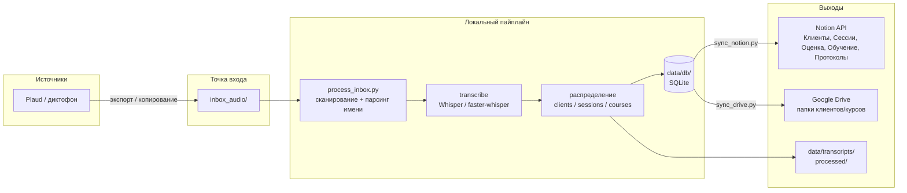

# Коннект: Plaud → локальный пайплайн → Notion + Drive

Единая схема связи по **NOTION_И_PLAUD_НАСТРОЙКА.md**: от записи в Plaud до карточек в Notion и файлов в Google Drive.

---

## Схема потока данных



---

## Что с чем связано

| Откуда | Куда | Как |
|--------|------|-----|
| **Plaud** | `inbox_audio/` | Ручной экспорт или копирование файлов. Конвенция имён: `client_Имя_YYYY-MM-DD_тип.m4a` или `course_название_модуль_урок.m4a`. |
| `inbox_audio/` | **Локальная БД + папки** | Скрипт `process_inbox.py`: транскрипция → парсинг имени → запись в SQLite (`data/db/`), транскрипты в `data/transcripts/`, аудио в `processed/clients/` или `processed/courses/`. |
| **SQLite** | **Notion** | Скрипт `sync_notion.py`: создание/обновление страниц в базах «Клиенты», «Сессии», «Оценка/диагностика», «Обучение/курсы» по данным из БД. |
| **SQLite + processed/** | **Google Drive** | Скрипт `sync_drive.py`: создание папок клиентов/курсов, загрузка аудио (и при необходимости транскриптов). |

---

## Базы Notion (по NOTION_И_PLAUD_НАСТРОЙКА.md)

| База | Назначение | Связи |
|------|------------|--------|
| **Клиенты** | Имя, контакты, запрос, жалобы, статус, дата первой консультации, ссылка на Drive, план, заметки | Relation ← Сессии |
| **Сессии** | Дата, тип (консультация/диагностика/тренировка/…), транскрипт, Summary, что сделали, рекомендации, ссылка на аудио | Relation → Клиенты |
| **Оценка/диагностика** | Зоны (шея, грудной, поясница, таз, колени, стопа, дыхание, осанка, походка) 0–3 | Relation → Клиент или Сессия |
| **Обучение/курсы** | Название, модуль, урок, ссылка на аудио/видео, транскрипт, конспект, ключевые идеи | — |
| **Протоколы и рекомендации** | Библиотека EG по зонам и протоколам | — |

Подробные свойства — в **NOTION_И_PLAUD_НАСТРОЙКА.md**.

---

## Конвенция имён файлов (вход в пайплайн)

- **Сессии по клиентам:**  
  `client_<ИмяИлиФамилия>_<YYYY-MM-DD>_<тип>.<расширение>`  
  Типы: `consultation` | `diagnostics` | `training` | `recovery` | `control` | `followup`

- **Уроки курсов:**  
  `course_<короткое_название>_<модуль>_<урок>.<расширение>`

Примеры:  
`client_vasya_2026-03-07_consultation.m4a`  
`course_fp_week6_lesson2.m4a`

Полное описание — в **PLAUD_NOTION_АВТОМАТИЗАЦИЯ.md**, раздел 3.

---

## Порядок действий по коннекту

1. **Notion:** создать базы и свойства по **NOTION_И_PLAUD_НАСТРОЙКА.md** (часть 1).
2. **Папки:** убедиться, что есть `inbox_audio/`, `processed/clients/`, `processed/courses/`, `data/db/`, `data/transcripts/`, `data/summaries/` (см. **СТРУКТУРА_ПАПОК_ЭКОСИСТЕМЫ.md**).
3. **Скрипты:** запускать пайплайн в порядке:
   - `process_inbox.py` — обработать новые файлы из `inbox_audio/`, заполнить SQLite и локальные папки;
   - `sync_notion.py` — выгрузить данные из SQLite в Notion;
   - при необходимости `sync_drive.py` — загрузить файлы в Drive.
4. **Plaud:** экспортировать записи в `inbox_audio/` с именами по конвенции выше.

---

## Файлы экосистемы (где что искать)

| Документ | Содержание |
|----------|------------|
| **NOTION_И_PLAUD_НАСТРОЙКА.md** | Поля баз Notion, чек-лист, связь с Plaud. |
| **PLAUD_NOTION_АВТОМАТИЗАЦИЯ.md** | Полный пайплайн, конвенция имён, структура папок, шаги скриптов. |
| **СТРУКТУРА_ПАПОК_ЭКОСИСТЕМЫ.md** | Дерево папок eg-ecosystem и связь с ботом/Notion/Drive. |
| **CONNECT_PLAUD_NOTION.md** | Этот файл — сводная схема коннекта. |

Скрипты пайплайна: `scripts/` (README в `scripts/README.md`).

---

## Автоматический режим: загрузил → подписал → всё в Notion

**Что делать:** загружаешь аудио в одну папку и «подписываешь», чем запись является — курсом или клиентом. Один запуск пайплайна транскрибирует, раскладывает по БД и выгружает в Notion.

### Как подписать (два способа)

1. **Папками (удобнее всего)**  
   - **Курс:** положи файл в `inbox_audio/courses/название_курса/`  
     Например: `inbox_audio/courses/breath/lesson1.m4a`, `inbox_audio/courses/таз/вступление.m4a`  
     Папка = подписка «это курс такой-то»; имя файла может быть любым.  
   - **Клиент:** положи файл в `inbox_audio/clients/имя_клиента/`  
     Например: `inbox_audio/clients/vasya/2026-03-07.m4a`  
     Папка = подписка «это сессия этого клиента»; дату можно в имени или возьмётся сегодня.

2. **Именем файла** (если кладёшь всё в корень `inbox_audio/`):  
   - `course_курс_модуль_урок.m4a` — урок курса  
   - `client_имя_2026-03-07_consultation.m4a` — сессия клиента  

### Один запуск после загрузки

```bash
cd eg-ecosystem
python scripts/run_pipeline.py
```

Скрипт по очереди: обрабатывает `inbox_audio/` (транскрипция Whisper → SQLite и папки), затем выгружает новые записи в Notion. Итог: база в Notion собирается автоматически — курсы в «Обучение/курсы», сессии клиентов в «Сессии» и «Клиенты».
